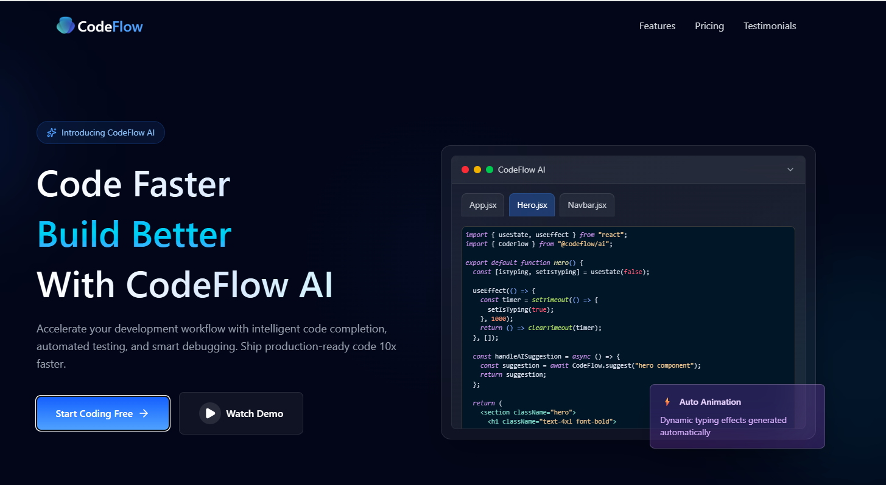
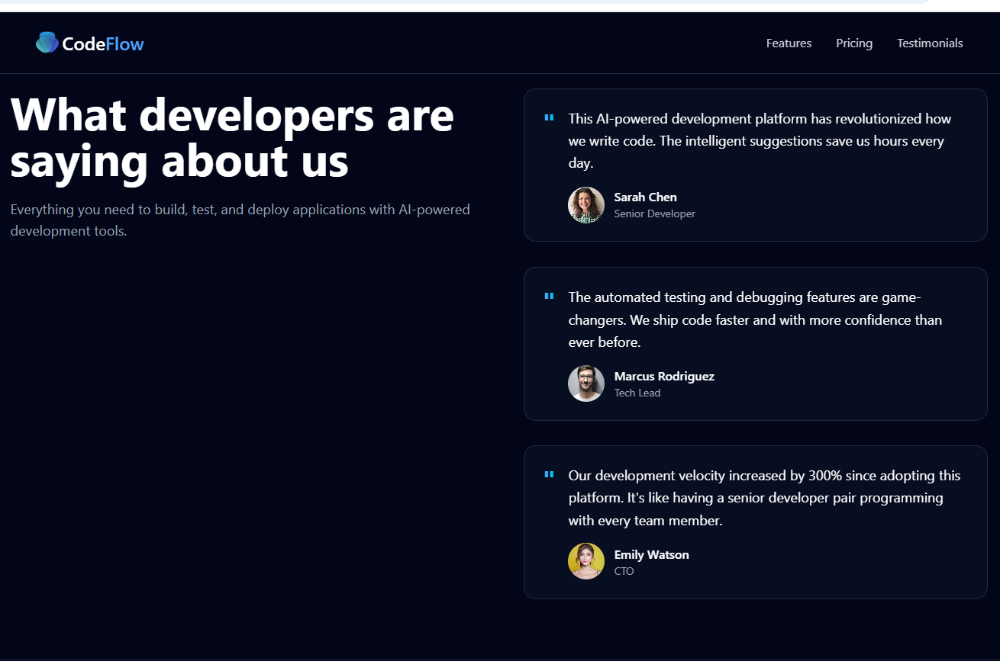
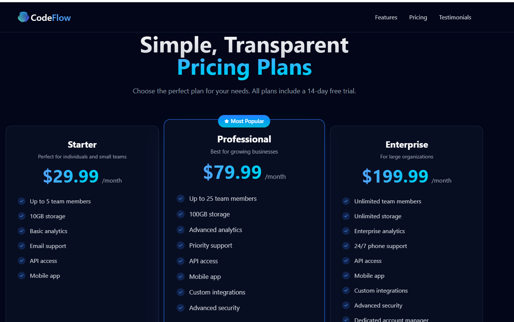

# Modern UX/UI - CodeFlow AI Landing Page

A modern, responsive landing page for CodeFlow AI built with React, Tailwind CSS, and Vite. Features a sleek dark theme with smooth animations and interactive elements.

## 🚀 Features

- **Responsive Design**: Fully responsive across all devices (mobile, tablet, desktop)
- **Dark Theme**: Modern dark slate theme with blue accents
- **Smooth Animations**: Custom CSS animations for enhanced user experience
- **Interactive Components**:
  - Dynamic navbar with scroll effects
  - Animated hero section with mouse tracking
  - Feature cards with hover effects
  - Pricing plans with interactive elements
  - Customer testimonials
  - Social media footer links
- **Code Syntax Highlighting**: Integrated code editor simulation with syntax highlighting
- **Performance Optimized**: Built with Vite for fast development and optimized production builds

## 🛠️ Tech Stack

- **Frontend Framework**: React 19
- **Build Tool**: Vite
- **Styling**: Tailwind CSS v4
- **Icons**: Lucide React
- **Code Highlighting**: React Syntax Highlighter
- **Development**: ESLint, Hot Module Replacement (HMR)

## 📦 Installation

1. **Clone the repository**

   ```bash
   git clone <repository-url>
   cd modern-ux-ui
   ```

2. **Install dependencies**

   ```bash
   npm install
   ```

3. **Start the development server**

   ```bash
   npm run dev
   ```

4. **Open your browser**
   Navigate to `http://localhost:5173` (or the port shown in your terminal)

## 🏗️ Build for Production

```bash
npm run build
```

The built files will be in the `dist/` directory.

## 🚀 Preview Production Build

```bash
npm run preview
```

## 📁 Project Structure

```
modern-ux-ui/
├── public/
│   └── logo.png                 # Logo asset
├── src/
│   ├── assets/                  # Static assets
│   ├── components/
│   │   ├── Navbar.jsx          # Navigation component
│   │   ├── Hero.jsx            # Hero section with code editor
│   │   ├── Features.jsx        # Features showcase
│   │   ├── Pricing.jsx         # Pricing plans
│   │   ├── Testimonials.jsx    # Customer testimonials
│   │   └── Footer.jsx          # Footer with links
│   ├── data/
│   │   └── CodeExample.js      # Sample code data
│   ├── App.jsx                 # Main app component
│   ├── main.jsx                # App entry point
│   └── index.css               # Global styles and Tailwind imports
├── index.html                   # HTML template
├── package.json                 # Dependencies and scripts
├── tailwind.config.js          # Tailwind configuration
├── vite.config.js              # Vite configuration
└── eslint.config.js            # ESLint configuration
```

## 🎨 Customization

### Colors and Theme

The app uses a dark theme with customizable colors. Main colors:

- Background: `slate-950`
- Primary: `blue-400` to `blue-600`
- Text: `white` and `gray-400`

### Animations

Custom animations are defined in `src/index.css`:

- `slide-in-from-bottom`
- `slide-in-from-top`
- Duration and delay utilities

### Components

Each component is modular and can be easily customized:

- Update content in component files
- Modify styles using Tailwind classes
- Add new sections by importing and placing in `App.jsx`

## 📸 Screenshots

### Screenshot 1: Hero Section



### Screenshot 2: Features Section



### Screenshot 3: Pricing Section



_Note: Screenshots are located in the `src/assets/` folder._

## 🔧 Development

### Available Scripts

- `npm run dev` - Start development server
- `npm run build` - Build for production
- `npm run preview` - Preview production build
- `npm run lint` - Run ESLint

### Code Quality

- ESLint configuration for React and modern JavaScript
- Prettier for code formatting (if configured)
- TypeScript support ready (types included)

## 🤝 Contributing

1. Fork the repository
2. Create a feature branch (`git checkout -b feature/amazing-feature`)
3. Commit your changes (`git commit -m 'Add amazing feature'`)
4. Push to the branch (`git push origin feature/amazing-feature`)
5. Open a Pull Request

## 📄 License

This project is private and proprietary.

## 🙏 Acknowledgments

- [Tailwind CSS](https://tailwindcss.com/) for the utility-first CSS framework
- [React](https://reactjs.org/) for the component-based UI library
- [Vite](https://vitejs.dev/) for the fast build tool
- [Lucide](https://lucide.dev/) for the beautiful icons
- [React Syntax Highlighter](https://github.com/react-syntax-highlighter/react-syntax-highlighter) for code highlighting

---

Built with ❤️ using modern web technologies.
